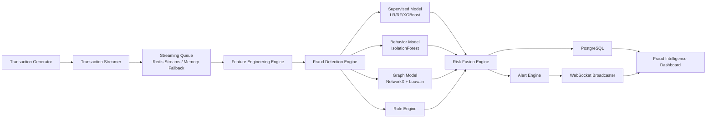

# Hybrid AI Fraud Detection Framework

## Real-Time Architecture

## Hybrid Risk Fusion

`risk_score = 0.4 * supervised_probability + 0.3 * behavioral_anomaly + 0.2 * graph_risk + 0.1 * rule_score`

Classification bands:

- `SAFE`: risk < 0.45
- `SUSPICIOUS`: 0.45 <= risk < 0.75
- `FRAUD`: risk >= 0.75

## Backend Modules

- `app/fraud_engine/` hybrid fusion + scoring pipeline
- `app/behavior_models/` behavioral profile and anomaly model
- `app/analytics/` graph detection, drift monitoring, experiment metrics
- `app/streaming/` Redis Streams / queue consumer
- `app/routes/` APIs, aliases, dashboard endpoints

## IEEE Experiment Support

Use `GET /api/experiments/metrics` for:

- latency (`mean`, `p95`, `p99`)
- throughput (`tx/sec`, `tx/min`)
- output distribution summary (`avg_risk_score`)

Use `GET /api/model/metrics` for model-comparison tables.
Use `GET /api/model/health` for drift monitoring.
